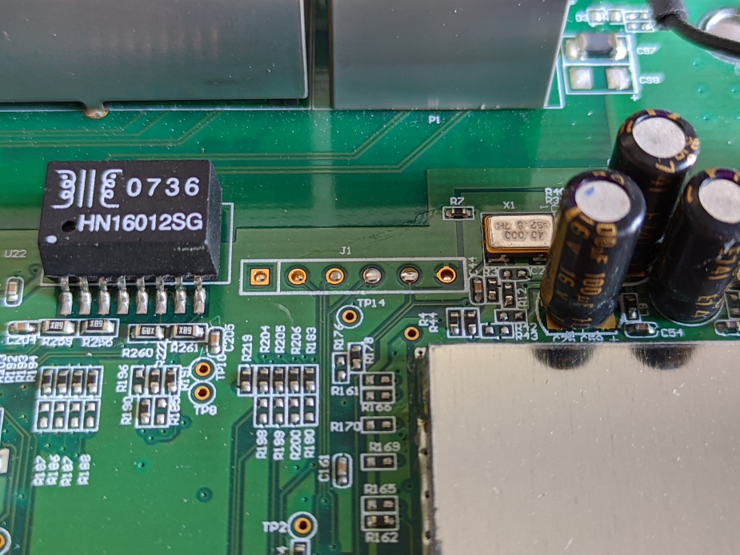
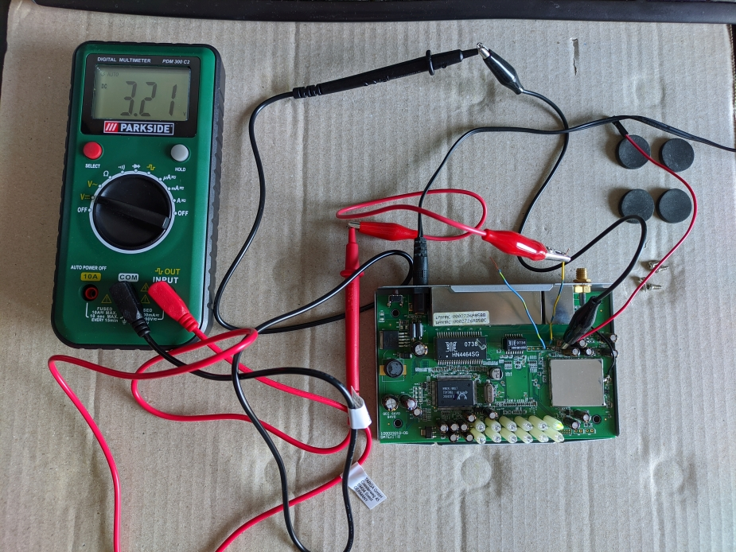
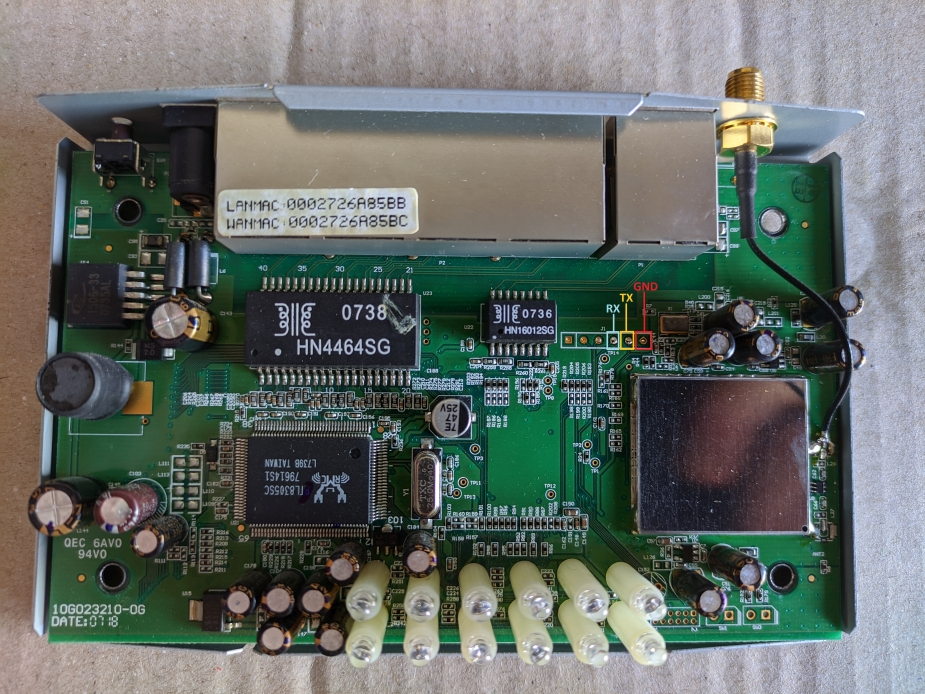
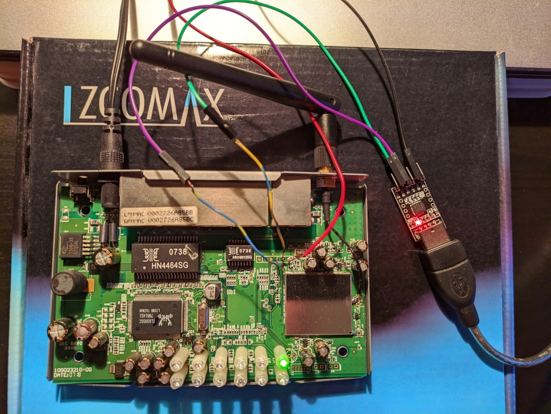
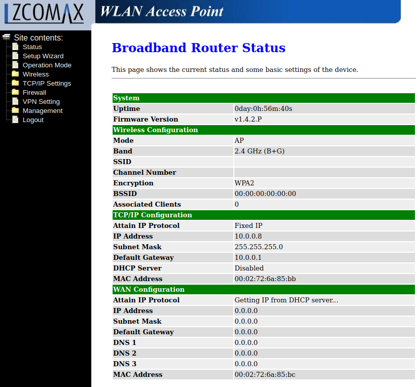

# Hardware hacking: Zcomax WA-2204A-TX


## Úvod

>Jedná se o multifunkční bezdrátový Accesspoint / Bridge / Router / Klient pro nasazení v pásmu 2,4 GHz dle standardu IEEE 802.11b/g.

>... funkce, jako např. WEP, WPA, WPA2, port filtering, IP filtering, podpora VPN, filtr MAC adres, port forwarding, DMZ hosting, WatchDog či QoS včetně podpory Bandwidth controlingu

Zdroj: <https://eshop.compos.cz/zcomax-wa-2204a-tx-wireless-802-11g-ap-client-router-switch-z-comax-_d166910.html>

### Poznámky
* Motivace provádět hacking na tak starém zařízení byla čistě ze zvědavosti s vědomím, že faktická důležitost potencionálně objevených zranitelností bude více méně nulová. 

 Takže **proč?**

* Tzv. na ostro si vyzkoušet vědomosti nabyté čtením teorie. 
* Pochopit principy a ověřit obecně platné postupy. PoC. 
* A hlavně se také zabavit :) 

##  Sériová konzole (UART)

Po sejmutí plastového krytu vidíme desku plošných spojů. Piny pro sériovou konzoli nejsou nijak označeny, ani není vidět chatakteristiké seskupení 4 pinů do "hřebínku" (GND, TX, RX a Vcc). S identifikací pomohl tento odkaz: <https://www.mylms.cz/pitva-routeru-panwa2204a/>, kde autor rozebírá podobný router na kterém piny rozpoznal. Na "naší" desce nalezneme až podezřeře stejnou šestici pinů v pravé horním rohu:



Budeme prozatím tedy věřit jak zmíněnému autorovy, tak výrobci routeru, že chtěl ušetřit a tak použil stejné rozložení na desce i pro jiné účely. Chybějící hřebínek z výroby nahradíme připájením vlastního a nebo jakéhokoli drátku. Stačí jen tři, zprava: GND (zde se omlouvám všem které mate červená barva vodiče, která by se pro zem neměla používat), TX a RX.



Připojíme multimetr zapnutý na měření stejnosměrného napětí k TX pinu routeru. Samozřejmě je nutné spojit zem (GND). Následně zapneme router. Po chvíli by měla hodnota napětí rychle "skákat" od 0 k 3,3 V. Záleží na tom, jak moc je router v konzoli upovídaný. Tímto je více méně potvrzena přístomnost komunikačního rozhraní UART, i když pro 100% jistotu by bylo potřeba místo multimetru připojit logický analyzátor.  

Doplněné označení jednotlivých pinů na desce zobrazuje následující fotografie:


Nyní připojíme UART-USB převodník a router znovu zapneme. Poslední neznámá co schází je, jakou nastavit přenosovou rychlost. Tu bychom samozřejmě zjistili pomocí logického analyátoru, který ale nemáme. Takže nezbývá než metoda pokus omy. Například podle tohoto zdroje: <http://www.ece.northwestern.edu/local-apps/matlabhelp/techdoc/matlab_external/baudrate.html> jsou nejčastější rychlosti v baudech (resp. bitech/s):
> 110, 300, 600, 1200, 2400, 4800, **9600**, 14400, 19200, 38400, 57600, **115200**, 128000 and 256000 bits per second.

Vzhledem k tomu, ze rychlosti pod 9600 baudů jsou dnes opravdu vzácné, můžeme s klidem zkusit všechny s vyšší hodnotou. Tučně jsem vyznačil ty, které jsou nejběžnější. Nicméně, tento router používá přenosovou rychlost: 38400 bitů/s.

V Linux použijeme např. program screen:
```
screen /dev/ttyUSB0 38400
```

Zde výsledný setup s UART-USB převodníkem:


### Boot log

Následuje plný záznam z konzole tak, jak ho zařízení ukazuje, když startuje:
```
UART1 output test ok
Uart init
mfid=00000001 devid=00002249
Found 1 x 2M flash memory

---RealTek(RTL8186)at 2006.09.26-15:32+0800 version 1.4.C [32bit](180MHz)
no sys signature at 00010000!
no sys signature at 00020000!
Jump to image start=0x80800000...
decompressing kernel:
Uncompressing Linux... done, booting the kernel.
done decompressing kernel.
early printk enabled 
Determined physical RAM map:
 memory: 01000000 @ 00000000 (usable)
Initial ramdisk at: 0x801d8000 (6348800 bytes)
On node 0 totalpages: 4096
zone(0): 4096 pages.
zone(1): 0 pages.
zone(2): 0 pages.
Kernel command line: root=/dev/ram console=0 ramdisk_start=0 single
Calibrating delay loop... 179.40 BogoMIPS
Memory: 7844k/16384k available (1715k kernel code, 8540k reserved, 6300k data, 56k init, 0k highmem)
Dentry-cache hash table entries: 2048 (order: 2, 16384 bytes)
Inode-cache hash table entries: 1024 (order: 1, 8192 bytes)
Mount-cache hash table entries: 512 (order: 0, 4096 bytes)
Buffer-cache hash table entries: 1024 (order: 0, 4096 bytes)
Page-cache hash table entries: 4096 (order: 2, 16384 bytes)
check_wait... unavailable.
POSIX conformance testing by UNIFIX
Linux NET4.0 for Linux 2.4
Based upon Swansea University Computer Society NET3.039
Initializing RT netlink socket
Starting kswapd
Serial driver version 6.02 (2003-03-12) with no serial options enabled
ttyS00 at 0x00c3 (irq = 3) is a rtl_uart1
state->flags=00000000
Realtek GPIO Driver for Flash Reload Default
block: 64 slots per queue, batch=16
RAMDISK driver initialized: 16 RAM disks of 7500K size 1024 blocksize
PPP generic driver version 2.4.1
PPP MPPE Compression module registered
RealTek Nor-Type Flash System Driver. (C) 2002 RealTek Corp.
Found 1 x 2M Byte AMD AM29LV160DB
flash: init complete (31), size 2048(KB) blks 1024 hs 512
RTL8185 driver version 1.12 (2006-12-27)
8186NIC Ethernet driver v0.0.7 (Nov 8, 2006)
eth0: RTL8186-NIC at 0xbd200000, 00:01:02:03:04:05, IRQ 4
eth1: RTL8186-NIC at 0xbd300000, 04:05:06:07:08:09, IRQ 5
fast_nat v1.3b
NET4: Linux TCP/IP 1.0 for NET4.0
IP Protocols: ICMP, UDP, TCP
IP: routing cache hash table of 512 buckets, 4Kbytes
TCP: Hash tables configured (established 1024 bind 2048)
rtl8186_crypto_init()...
rtl8186_crypto: IPSec status(RTL8186_IPSCFR) = B
rtl8186_crypto: IPSec status(RTL8186_IPSCTR) = 2027202
ipsec_3des_init(alg_type=15 alg_id=3 name=3des): ret=0
ipsec_aes_init(alg_type=15 alg_id=12 name=aes): ret=0
ipsec_md5_init(alg_type=14 alg_id=2 name=md5): ret=0
ipsec_null_init(alg_type=15 alg_id=11 name=null): ret=0
ipsec_sha1_init(alg_type=14 alg_id=3 name=sha1): ret=0
ip_conntrack version 2.1 (128 buckets, 1024 max) - 332 bytes per conntrack
PPTP netfilter connection tracking: registered
PPTP netfilter NAT helper: registered
ip_tables: (C) 2000-2002 Netfilter core team
NET4: Unix domain sockets 1.0/SMP for Linux NET4.0.
NET4: Ethernet Bridge 008 for NET4.0
RAMDISK: ext2 filesystem found at block 0
RAMDISK: Loading 6200 blocks [1 disk] into ram disk... done.
Freeing initrd memory: 6200k freed
VFS: Mounted root (ext2 filesystem).
Freeing unused kernel memory: 56k freed
mount /proc file system ok!
serial console detected.  Disabling virtual terminals.
init started:  BusyBox v1.00-pre8 (2004.12.03-02:38+0000) multi-call binary


BusyBox v1.00-pre8 (2004.12.03-02:38+0000) Built-in shell (ash)
Enter 'help' for a list of built-in commands.

killall: pptp.sh: no process killed
killall: pppoe.sh: no process killed
Initialize wlan0 interface
pmib->mib_version=12
Setup BRIDGE interface
killall: syslogd: no process killed
killall: klogd: no process killed
SIOCGIFFLAGS: No such device
bridge br0 doesn't exist; can't delete it
Setup bridge...
device eth0 entered promiscuous mode
eth0:phy is 8305
SIOCDELRT: No such process
device wlan0 entered promiscuous mode
SIOCDELRT: No such process
br0: port 2(wlan0) entering listening state
br0: port 1(eth0) entering listening state
br0: port 2(wlan0) entering learning state
br0: port 2(wlan0) entering forwarding state
br0: topology change detected, propagating
br0: port 1(eth0) entering learning state
br0: port 1(eth0) entering forwarding state
br0: topology change detected, propagating
SIOCDELRT: No such process
SIOCDELRT: No such process
SIOCDELRT: No such process
Setup WAN interface
eth1:phy is 8305
SIOCDELRT: No such process
UPnP (Ver 1.02)
killall: ntp.sh: no process killed
auth uses obsolete (PF_INET,SOCK_PACKET)

IEEE 802.1x (WPA) daemon, version 1.7
Start NTP daemon
Auto-Discovery (ver 1.01) 
IEEE 802.11f (IAPP) using interface br0 (v1.6)
killall: watchdog.sh: no process killed
```

## Průzkum systému

Poté, co zařízení nabootuje máme přístupný nezaheslovanému shellu. Jednoduchým zadáním příkazu `id`:
```
# id
uid=0(root) gid=0(root)
```
zjistíme, že jseme přihlášeni jako uživatel `root`, takže máme plný přístup do systému.

Zkusíme se podívat na výpis z BusyBoxu, abychom zjistili dostupné příkazy:
```
# busybox
BusyBox v1.00-pre8 (2004.12.03-02:38+0000) multi-call binary

Usage: busybox [function] [arguments]...
   or: [function] [arguments]...

        BusyBox is a multi-call binary that combines many common Unix
        utilities into a single executable.  Most people will create a
        link to busybox for each function they wish to use, and BusyBox
        will act like whatever it was invoked as.

Currently defined functions:
        [, ash, bunzip2, busybox, bzcat, cat, cut, date, dirname, echo,
        egrep, expr, grep, head, hostname, id, ifconfig, init, kill, killall,
        klogd, logger, netstat, ping, ps, reboot, rm, route, sed, sh,
        sleep, sort, syslogd, tail, test, tr, uname, wc

```

Příliš toho není, ale některé se přeci jen hodí Zde například podrobnosti o systému a architektuře:.
```
# busybox uname -a
Linux (none) 2.4.18-MIPS-01.00 #79 Wed Apr 18 14:37:44 CST 2007 mips unknown
# uname -a
Linux (none) 2.4.18-MIPS-01.00 #79 Wed Apr 18 14:37:44 CST 2007 mips unknown
```
Jak je vidět, příkazy jsou prolinkované, takže není před každý potřeba zadávat `busybox` a dostaneme stejný výstup.

Spuštěné programy:
```
# ps
  PID  Uid     VmSize Stat Command
    1 root        260 S   init
    2 root            SW  [keventd]
    3 root            SWN [ksoftirqd_CPU0]
    4 root            SW  [kswapd]
    5 root            SW  [bdflush]
    6 root            SW  [kupdated]
    7 root        352 S   -sh
  298 root        232 S   syslogd -L
  301 root        216 S   klogd
  372 root        312 S   /bin/sh /bin/dhcpc.sh eth1 wait
  384 root        208 S   udhcpc -i eth1 -p /etc/udhcpc/udhcpc-eth1.pid -s /usr
  394 nobody      252 S   dnrd -s 168.95.1.1
  429 root        372 S   upnpd lo br0 WLAN-VPN
  442 root        312 S   /bin/sh /bin/ntp.sh
  453 root        188 S   disc_server br0
  479 root        156 S   sleep 3600
  481 root        396 S   webs
  482 root        192 S   reload
  491 root        372 S   upnpd lo br0 WLAN-VPN
  492 root        372 S   upnpd lo br0 WLAN-VPN
  494 root        372 S   upnpd lo br0 WLAN-VPN
  496 root        372 S   upnpd lo br0 WLAN-VPN
  497 root        372 S   upnpd lo br0 WLAN-VPN
  502 root        244 R   ps
```

Naslouchající porty (`netstat` má omezené parametry, takže nelze například zjistit ke kterým daemonům jednotlivě patří):
```
# netstat -anut
Active Internet connections (servers and established)
Proto Recv-Q Send-Q Local Address           Foreign Address         State
tcp        0      0 0.0.0.0:52869           0.0.0.0:*               LISTEN
tcp        0      0 0.0.0.0:80              0.0.0.0:*               LISTEN
tcp        0      0 0.0.0.0:53              0.0.0.0:*               LISTEN
udp        0      0 127.0.0.1:2048          0.0.0.0:*
udp        0      0 0.0.0.0:53              0.0.0.0:*
udp        0      0 0.0.0.0:21212           0.0.0.0:*
udp        0      0 0.0.0.0:1900            0.0.0.0:*
```
k jednotlivým službám se ješzě vrátíme.

Obsah souboru `/etc/passwd`:
```
# cat /etc/passwd
root:abSQTPcIskFGc:0:0:root:/:/bin/sh
nobody:x:99:99:Nobody:/:

```
je zde uloženo zašiforvané heslo k `root` účtu. Použitá šifra je s největší pravděpodobností DES. Vzhledem k tomu, že už máme root přístup a žádný jiný dostupný shell není k dispozici (telnet/ssh), považuji za zbytečné se pouštět do crackování.

Bohužel není k dispozici příkaz `ls`
```
# ls
-sh: ls: not found
```
takže systém lze procházet například primitivní kontrukcí s `echo *`:
```
# pwd
/
# pwd; echo *
/
bin dev etc lib lost+found proc sbin tmp usr var web
# cd /bin; pwd; echo *
/bin
ash auth autoconf awk brctl bridge.sh bridge_nonat.sh busybox bwc.sh cat checkdns.sh connect.sh date ddns.sh dhcpc.sh dhcpd.sh disc_server disconnect.sh dnrd dos.sh echo egrep firewall.sh fixedip.sh flash grep hostname iapp init.sh init_nonat.sh ip iptables iwcontrol iwpriv kill killsh.sh netstat ntp.sh ntpclient ping ping.sh pppd pppoe.sh pptp pptp.sh ps reload reload.sh rm sed sh sleep tc udhcpc udhcpd uname updatedd upnp.sh upnp_nonat.sh upnpd vpn.sh watchdog.sh webs wlan.sh wlan_nonat.sh wlanapp.sh

```

Vnitřní struktura je vcelku minimalistická. V adresáři `/bin` jsou umístěny skripty které ovládají jednotlivé komponenty Linuxu odpovídající za funkci routeru: směrování, NAT, firewall, PPP, atd.

Ve složce `/web` je pak umísten "frontend" pro webové uživatelské rozhraní: 
```
# cd /web; pwd; echo *
/web
cert.asp code.asp common.js config.dat ddns.asp dhcptbl.asp dmz.asp dos.asp graphics home.asp ipfilter.asp logout.asp macfilter.asp menu-images menu.asp menu_empty.html mtmcode.js ntp.asp opmode.asp password.asp portfilter.asp portfw.asp qosip.asp rsakey.asp saveconf.asp stats.asp status.asp syscmd.asp syslog.asp tcpiplan.asp tcpipwan.asp title.htm upload.asp urlfilter.asp vpn.asp vpnadvanced.asp vpnsetup.asp watchdog.asp wizard.asp wlactrl.asp wladvanced.asp wlbasic.asp wlstatbl.asp wlsurvey.asp wlwds.asp wlwdsenp.asp wlwdstbl.asp wlwep.asp wlwpa.asp
```

jednotlivé soubory představuji webové stránky konfigurace. Na pozadí se volá JavaScript:
```
# cat tcpiplan.asp
<html>
<! Copyright (c) Realtek Semiconductor Corp., 2003. All Rights Reserved. ->
<head>
<meta http-equiv="Content-Type" content="text/html">
<title>LAN Interface Setup </title>
<% language=javascript %>
<script type="text/javascript" src="common.js"> </script>
<SCRIPT>
var initialDhcp;
function dhcpChange(index)
{
  if ( index != 2 ) {
          disableTextField(document.tcpip.dhcpRangeStart);
          disableTextField(document.tcpip.dhcpRangeEnd);
          enableTextField(document.tcpip.lan_gateway);
          disableButton( document.tcpip.dhcpClientTbl );
          disableTextField(document.tcpip.domainName);
  }
  else {
          enableTextField(document.tcpip.dhcpRangeStart);
          enableTextField(document.tcpip.dhcpRangeEnd);
          disableTextField(document.tcpip.lan_gateway);
          enableButton( document.tcpip.dhcpClientTbl );
          enableTextField(document.tcpip.domainName);
  }
  if ( index == 1 ) {
          disableTextField(document.tcpip.lan_ip);
          disableTextField(document.tcpip.lan_mask);
          disableTextField(document.tcpip.lan_gateway);
  }
  else {
          enableTextField(document.tcpip.lan_ip);
          enableTextField(document.tcpip.lan_mask);
          enableTextField(document.tcpip.lan_gateway);
  }
}

function resetClick()
{
   dhcpChange( initialDhcp );
   document.tcpip.reset;
}

...
```
Analýzou zdrojových kódů by se hypoteticky dala objevit potenciální zranitelnost (vzhledem k zastaralosti celého systému sázím na nějaký command injection), nicméně nemám v této oblasti dostatečné znalosti a strávený čas jen a pouze na této činnosti my nedává moc smysl.

Ze souboru `/var/log/messages` lze např. vyčíst, nainstalovaný UPnP deamon:
```
Jun 20 19:26:21 (none) kern.info syslog: UPnP IGD (Pseudo ICS daemon) Ver.0.1 by WILDLAB (lamb-info@wildlab.com)
Jun 20 19:26:21 (none) kern.info syslog: UPnP library loaded, Thanks to developper in Intel !
Jun 20 19:26:21 (none) kern.debug syslog: Intializing UPnP  ^Iwith desc_doc_url=http://10.0.0.8:52869/picsdesc.xml ^I
Jun 20 19:26:21 (none) kern.debug syslog: ^I     ipaddress=10.0.0.8 port=52869
Jun 20 19:26:21 (none) kern.debug syslog: ^I     conf_dir_path=/etc/linuxigd/
Jun 20 19:26:21 (none) kern.debug syslog: UPnP Initialized
Jun 20 19:26:21 (none) kern.debug syslog: Specifying the webserver root directory -- /etc/linuxigd/
``` 


Další zajímavý je soubor `/var/umconfig.txt` který slouží pro dočasný zápis konfigurace. Změníte-li např. heslo k webovému rozhraní, tak se zapíše do tohoto souboru. Nicméně, reboot routeru tento soubor nepřežije, takže pokud zapomenete heslo, je důležité router nevypínat.

```
# cat /var/umconfig.txt
TABLE=users
ROW=0
name=admin
password=admin123
group=administrators
prot=0
disable=0
TABLE=groups
ROW=0
name=administrators
priv=4
method=2
prot=0
disable=0
TABLE=access
ROW=0
name=/
method=1
secure=0
group=administrators
```

## Skenování portů

### TCP sken
Výstup z programu nmap s parametry: `nmap -v -sC -sV -p- -A`, tzv plný sken:
```
Nmap scan report for 10.0.0.8
Host is up (0.016s latency).
Not shown: 65532 closed tcp ports (reset)
PORT      STATE SERVICE VERSION
53/tcp    open  domain?
80/tcp    open  http    GoAhead WebServer
| http-auth: 
| HTTP/1.1 401 Unauthorized\x0D
|_  Basic realm=Wireless Access Point
|_http-title: Document Error: Unauthorized
| http-methods: 
|_  Supported Methods: GET HEAD POST
|_http-server-header: GoAhead-Webs
52869/tcp open  upnp    Intel UPnP reference SDK 1.2 (Linux 2.4.18-MIPS-01.00; UPnP 1.0)
MAC Address: 00:02:72:6A:85:BB (CC&C Technologies)
Service Info: OS: Linux; CPE: cpe:/o:linux:linux_kernel:2.4.18-mips-01.00

...
# Nmap done at Thu Jun 16 22:42:24 2022 -- 1 IP address (1 host up) scanned in 226.77 seconds

```
Skenování probíhalo s klientem připojeným k LAN portu routeru. Na WAN rozhraní v defaultním nastavení nenaslouchá žádný program. Web management se musí explicitně povolit,

### UDP sken

Pomocí příkazu `nmap -v -sU -sC -sV -A`

```
Nmap scan report for 10.0.0.8
Host is up (0.0020s latency).
Not shown: 996 closed udp ports (port-unreach)
PORT      STATE         SERVICE VERSION
53/udp    open          domain  NLnet Labs NSD
|_dns-recursion: Recursion appears to be enabled
1900/udp  open|filtered upnp
2049/udp  open|filtered nfs
21212/udp open|filtered unknown
MAC Address: 00:02:72:6A:85:BB (CC&C Technologies)

...
Nmap done: 1 IP address (1 host up) scanned in 1239.38 seconds
           Raw packets sent: 1431 (65.366KB) | Rcvd: 1277 (122.530KB)
```

## Webové rozhraní

Výchozí přihlašovací údaje jsou `admin` a prazdné heslo, takže o zabezpečení nemůže být ani řeč. Na portu `tcp/80` beží webový server GoAhead, bohužel se mi nepodařilo zjistit verzi pro případné hledání příslušného exploitu.

Bez zadání přihlašovacích údajů dostaneme suché "Unauthorized":
```                     
HTTP/1.1 401 Unauthorized
Server: GoAhead-Webs
Date: Wed Jun 22 17:42:50 2022
WWW-Authenticate: Basic realm="Wireless Access Point"
Pragma: no-cache
Cache-Control: no-cache
Content-Type: text/html

<html><head><title>Document Error: Unauthorized</title></head>
                <body><h2>Access Error: Unauthorized</h2>
                when trying to obtain <b>/</b><br><p>Access to this document requires a User ID</p></body></html>

```

A po zadání jména a hesla, například `curl -i -L -u "admin:<PASSWORD>" http://10.0.0.8`:
```
HTTP/1.0 302 Redirect
Server: GoAhead-Webs
Date: Wed Jun 22 17:44:42 2022
Pragma: no-cache
Cache-Control: no-cache
Content-Type: text/html
Location: http://10.0.0.8/home.asp

HTTP/1.0 200 OK
Date: Wed Jun 22 17:44:42 2022
Server: GoAhead-Webs
Pragma: no-cache
Cache-Control: no-cache
Content-type: text/html

<html>
<head>
<meta http-equiv="Content-Type" content="text/html">
<title>WLAN Broadband Router</title>
</head>

<FRAMESET ROWS="60,1*" COLS="*" BORDER="0" FRAMESPACING="0" FRAMEBORDER="NO">

  <FRAME SRC="title.htm" NAME="title" FRAMEBORDER="NO" SCROLLING="NO" MARGINWIDTH="0" MARGINHEIGHT="0">

  <FRAMESET COLS="180,1*">

    <frameset frameborder="0" framespacing="0" border="0" cols="*" rows="0,*">
      <frame marginwidth="0" marginheight="0" src="code.asp" name="code" noresize scrolling="no" frameborder="0">
      <frame marginwidth="5" marginheight="5" src="menu_empty.html" name="menu" noresize scrolling="auto" frameborder="0">
    </frameset>
    <frame SRC="status.asp" NAME="view" SCROLLING="AUTO" MARGINWIDTH="0" TOPMARGIN="0" MARGINHEIGHT="0" FRAMEBORDER="NO">

  </FRAMESET>
</FRAMESET>

<NOFRAMES>
<BODY BGCOLOR="#FFFFFF">

</BODY></NOFRAMES>
</HTML>
```

Po přihlášení se zobrazí úvodní stránka se statusem:




## UPnP

Na portech `tcp/52869` a `udp/1900` běží služba UPnP, resp. první port slouží k popisu služby pro ostatní klienty, druhý port je pak pro přenos samotného obsahu. Vzhledem k absenci multimediální podpory, tak odhaduji podporu pro otvírání portů skrz NAT.

Verzi UPnP daemona lze kromě výše uvedeného nmap skenu zjistit i pomocí otevření daného portu: `curl -i http://10.0.0.8:52869/`
```
HTTP/1.1 404 Not Found
SERVER: Linux/2.4.18-MIPS-01.00, UPnP/1.0, Intel SDK for UPnP devices /1.2
CONNECTION: close
CONTENT-LENGTH: 48
CONTENT-TYPE: text/html

<html><body><h1>404 Not Found</h1></body></html>   
```

Ve složce upnp v tomto repu, jsou pak XML soubory které se podařilo enumerovat. Nicméně nejsou téměř k ničemu. K verzi serveru se nepodařilo zjistit žádnou zranitelnost.

## NFS?

Router má otevřený port `udp/2049` které standardně patří službě pro přenos souborů NFS. Podle všeho ale implementace nebyla dokončena a není ani funkční: např. chybí soubor `/etc/exports` v routeru a nelze zjistit zadne sdilene slozky:
```
showmount -e 10.0.0.8
clnt_create: RPC: Unable to receive
```

## DNS

Portech `tcp/53` a `udp/53` patří NLnet Labs Name Server Daemon (NSD), což je klasický deamon pro DNS forwarding (<https://github.com/NLnetLabs/nsd>), bohužel opět, bez exploitu.